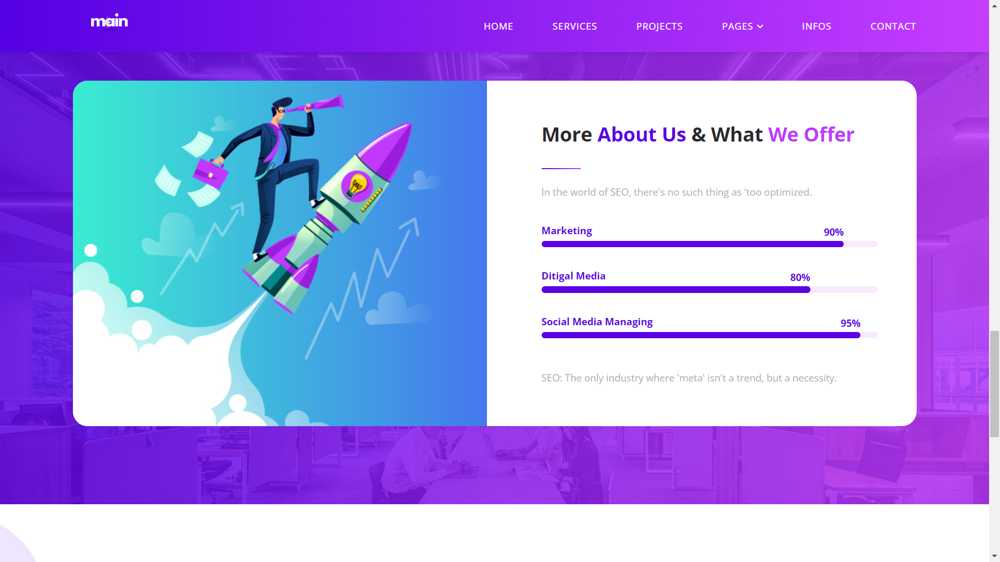

https://naimkatiman.github.io/SEO-Agency/

# SEO Agency Website





## Description

This is a modern, responsive website template for an SEO Digital Agency. It features a clean design with multiple pages showcasing various services, projects, and information about the agency.

## Features

- Responsive design
- Multi-page layout (Home, About, FAQs)
- Services showcase
- Project portfolio
- Team introduction
- Contact form
- Interactive elements (accordion, carousel)

## Pages

1. **Home (index.html)**
   - Hero section with call-to-action
   - Services overview
   - Project showcase
   - About us section
   - Contact form

2. **About (about.html)**
   - Company introduction
   - Video section
   - Skills showcase
   - Client testimonials

3. **FAQs (faqs.html)**
   - Frequently asked questions
   - Contact form

## Technologies Used

- HTML5
- CSS3
- Bootstrap 5.2
- JavaScript
- jQuery

## Installation

1. Clone the repository:
   ```
   git clone https://github.com/yourusername/seo-agency-website.git
   ```
2. Open the project folder in your code editor.
3. Open `index.html` in your web browser to view the website.

## Customization

- Update the content in the HTML files to match your agency's information.
- Modify the CSS in the `assets/css` directory to change the styling.
- Replace the images in the `assets/images` directory with your own.


## License

Copyright © 2024 Main SEO Agency. All rights reserved.

